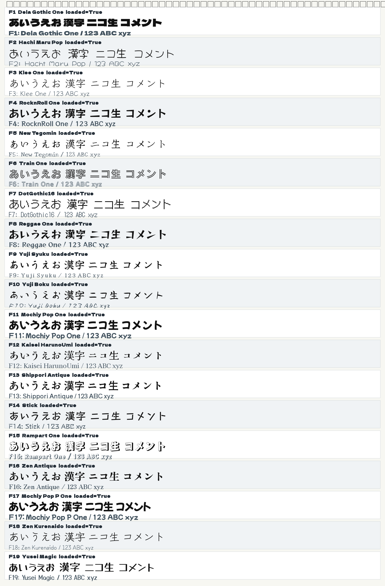

# Google Fonts 字形確認メモ

## 確認方法

- 対象: `app.profiles.comment_setting_command.KIRITORIKUN_FONTS` の F1 から F19。
- 方法: アプリ実装の `load_google_font_family()` で Google Fonts から実フォントを取得し、Qt に登録して同じ日本語サンプルを描画した。
- サンプル文字列: `あいうえお 漢字 ニコ生 コメント`
- 描画結果: `docs/google_font_shape_contact_sheet.png`
- 読み込み結果: 19件すべて `loaded=True`。

## 字形観察

| ID | Font | 見た目の特徴 | 向いている印象 |
| --- | --- | --- | --- |
| F1 | Dela Gothic One | 極太で黒面積が大きい。角が強く、見出しとしてかなり目立つ。 | 強い、うるさい、主張が強い、ツッコミ役 |
| F2 | Hachi Maru Pop | 細めの丸い手書き。線がゆるく、かなり柔らかい。 | かわいい、ゆるい、天然、軽い雑談 |
| F3 | Klee One | ペン字寄りの手書き。細く整っていて落ち着く。 | 上品、静か、丁寧、文芸寄り |
| F4 | RocknRoll One | 太めで丸みのあるポップゴシック。勢いはあるが読みやすい。 | 元気、明るい、配信向け、標準ポップ |
| F5 | New Tegomin | 古い活字と手書きの中間。細く、和風で物語感がある。 | 和風、昔話、落ち着き、少し怪しい雰囲気 |
| F6 | Train One | 文字内部に縞が入る装飾フォント。本文より看板向け。 | 派手、ネタ、タイトル、特殊演出 |
| F7 | DotGothic16 | ドット表示風。直線とピクセル感が強い。 | レトロ、ゲーム、機械、昔のPC風 |
| F8 | Reggae One | 太く、角が削れたような癖がある。勢いとクセが強い。 | 陽気、クセ強、派手、荒めのキャラ |
| F9 | Yuji Syuku | 筆文字だが整っている。和風で硬すぎない。 | 和風、礼儀正しい、落ち着いた強さ |
| F10 | Yuji Boku | 筆跡がラフで揺れが大きい。手書き感がかなり強い。 | 荒い、感情的、勢い、野性味 |
| F11 | Mochiy Pop One | 極太で丸い。黒面積が大きく、かわいいが強く読める。 | かわいい、元気、強い、目立つコメント |
| F12 | Kaisei HarunoUmi | 明朝寄りで細め。余白があり、品がある。 | 文学的、落ち着き、真面目、知的 |
| F13 | Shippori Antique | アンティークな明朝。太さは中程度で読みやすい。 | 古風、上品、安定、落ち着いた常連 |
| F14 | Stick | 細く直線的で角張る。手書きより記号・棒文字に近い。 | 無機質、変わり者、機械的、クール |
| F15 | Rampart One | 輪郭と影のある装飾文字。本文には重いが一発で目立つ。 | 祭り、看板、強調、イベント通知 |
| F16 | Zen Antique | 太めの明朝系。和風で硬さがあり、読みやすい。 | 伝統、落ち着き、格式、真面目 |
| F17 | Mochiy Pop P One | Mochiy Pop 系の太丸文字。F11より詰まり方が少し自然。 | かわいい、親しみ、常用ポップ、強め |
| F18 | Zen Kurenaido | 細く丸い手書き。柔らかく、主張は控えめ。 | 優しい、静か、女性的、穏やか |
| F19 | Yusei Magic | マーカー手書き風。太さは中程度で会話文に使いやすい。 | 親しみ、手書き感、日常会話、自然体 |

## 使い分け方針

- 強く目立たせる: F1, F4, F8, F11, F15, F17
- かわいく柔らかくする: F2, F11, F17, F18, F19
- 和風・古風に寄せる: F5, F9, F10, F12, F13, F16
- ネタ・特殊演出に使う: F6, F7, F14, F15
- 長文でも読みやすい候補: F4, F11, F13, F16, F17, F19

## 注意

この確認は Qt 上の実レンダリングで見た結果。OBS Browser Source ではブラウザのアンチエイリアス差が出る可能性はあるが、読み込む Google Fonts の family は同じなので、字形の方向性はこの一覧で判断できる。
